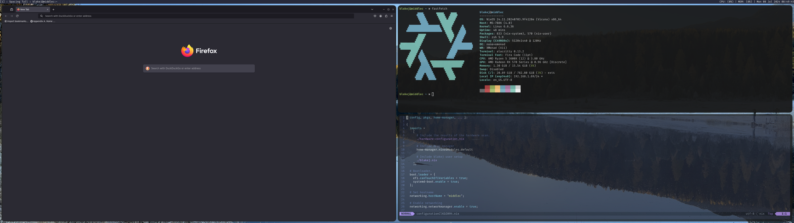

# nixos-config
My current NixOS configuration.

## To-do
- [ ] Configure [kmonad](https://github.com/kmonad/kmonad)
- [ ] Theming for [dmenu](https://tools.suckless.org/dmenu)
- [ ] Setup [lsp_zero](https://github.com/VonHeikemen/lsp-zero.nvim) for neovim

## Screenshot

